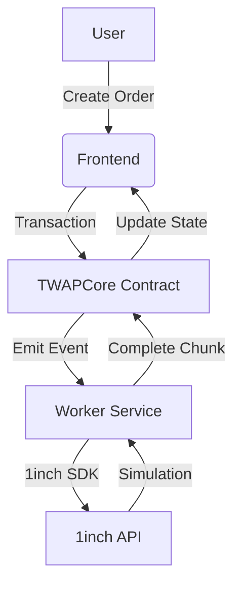

# Nextinch - TWAP Execution Engine for 1inch : Comprehensive Documentation

## Project Structure
```bash
nextinch-twap/
├── contracts/            # Smart contracts
├── frontend/             # User interface
├── scripts/              # Worker scripts
└── README.md             # Main documentation
```

## 1. Smart Contracts (`contracts/`)

### TWAPCore.sol
The core strategy contract implementing TWAP execution logic.

**Key Features:**
- TWAP order creation with customizable parameters
- Chunk-based execution scheduling
- Fund management and security
- Event-based communication with off-chain workers

**Important Functions:**
```solidity
function createTWAPOrder(
    address makerAsset,
    address takerAsset,
    uint256 totalAmount,
    uint256 chunks,
    uint256 interval,
    uint256 slippageBips
) external returns (bytes32 orderId)

function completeChunk(bytes32 orderId, uint256 chunkIndex) external

function cancelOrder(bytes32 orderId) external
```

### ERC20Mock.sol
Test token implementation for demo purposes.

## 2. Frontend Application (`frontend/`)

### Next.js Application
Modern React-based UI for interacting with the TWAP strategy.

**Key Components:**
- **Order Creation Form:** Create new TWAP orders
- **Dashboard:** View active and completed orders
- **Order Details:** Track execution progress of each order
- **Wallet Integration:** Connect MetaMask or other Web3 wallets

**Technology Stack:**
- Next.js 14
- Tailwind CSS
- Ethers.js
- Shadcn/ui components
- Vercel deployment

## 3. Scripts (`scripts/`)


### Worker Scripts
1. `worker.js`: Off-chain order processing service
```bash
node scripts/worker.js
```

**Worker Responsibilities:**
- Listens for `ChunkScheduled` events
- Builds 1inch orders using SDK
- Simulates orders via 1inch API
- Updates on-chain state after successful simulation

## 4. Testing (`test/`)

### Foundry Tests
Comprehensive test suite for smart contracts:
```bash
forge test
```

**Key Test Cases:**
- TWAP order creation
- Chunk execution workflow
- Order cancellation
- Edge case handling
- Security checks

### Frontend Tests
Cypress end-to-end tests:
```bash
cd frontend
pnpm run dev
```

## 5. How to Run the Project

### Prerequisites
- Node.js v18+
- Foundry (for smart contract development)
- 1inch API key
- MetaMask wallet

### Setup Instructions

1. **Clone repository:**
```bash
git clone https://github.com/PhantomOz/nextinch.git
cd nextinch
```

2. **Install dependencies:**
```bash
cd frontend && pnpm install
cd ../scripts && npm install
```

3. **Configure environment:**
```bash
cp .env.example .env
# Fill in your values
```

4. **Start local blockchain:**
```bash
npx hardhat node
```

5. **Deploy contracts:**
```bash
forge script script/Twap.s.sol  --rpc-url <network-rpc> --private-key <your-pk> --broadcast 
```

6. **Fund test accounts:**
```bash
forge script run script/fundwallet.s.sol --rpc-url <network-rpc> --private-key <your-pk> --broadcast
```

7. **Start worker:**
```bash
node scripts/index.js
```

8. **Start frontend:**
```bash
cd frontend
pnpm run dev
```

9. **Access the application:**
```
http://localhost:3000
```

## 6. Demo Walkthrough

1. **Connect Wallet:**
   - Click "Connect Wallet" in top-right corner
   - Select MetaMask and connect to Localhost:8545

2. **Create TWAP Order:**
   - Select USDC as maker token
   - Select WETH as taker token
   - Set amount to 1000 USDC
   - Configure 5 chunks with 5-minute intervals
   - Set slippage to 1%
   - Click "Create Order"

3. **Monitor Execution:**
   - View order in dashboard
   - See chunks transition from "Scheduled" to "Executed"
   - Track progress bar

4. **Cancel Order:**
   - Select active order
   - Click "Cancel Order"
   - Verify funds returned to wallet

## 7. Architecture Overview



## 8. Security Considerations

1. **Fund Safety:**
   - User funds held in contract until execution
   - Cancellable at any time
   - No direct access to funds by worker

2. **Input Validation:**
   - Parameter bounds checking
   - Sequence enforcement
   - Access control

3. **Simulation First:**
   - All orders simulated before state update
   - Prevents failed transactions

## 9. Future Improvements

1. **Multi-Chain Support:**
   - Ethereum Mainnet
   - Polygon
   - BSC

2. **Advanced Order Types:**
   - Limit orders
   - Stop-loss
   - OCO (One-Cancels-Other)

3. **Decentralized Execution:**
   - Keeper network
   - Incentive mechanisms
   - MEV protection

## 10. Contributing

1. Fork the repository
2. Create your feature branch (`git checkout -b feature/amazing-feature`)
3. Commit your changes (`git commit -m 'Add some amazing feature'`)
4. Push to the branch (`git push origin feature/amazing-feature`)
5. Open a pull request

## 11. License

MIT License - see [LICENSE](LICENSE) for details

`HACKED AT ETHGlobal UNITE DEFI HACKATHON`